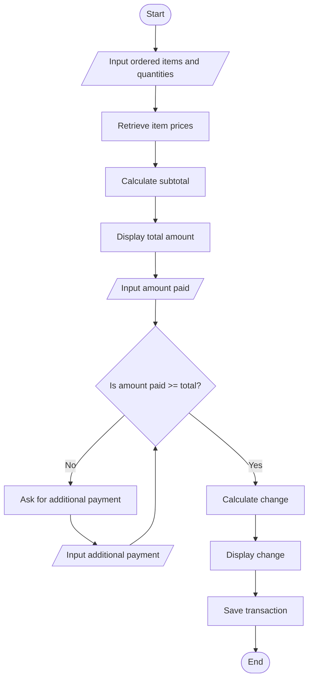

Section: 09 - Balingkilat  
C#/Names: - 01 - Aguas | 02 - Amador | 03 - Antonio 
Date: 11/08/2026

# Main Problem: 
The canteen's process of selling relies on manual tracking which can be inefficient and unreliable.

# Sub-Problems: 
1. Students kill time because they take too long to decide what to order.
2. Inventory tracking is not present, so staffs don't know when items are about to run out.
3. Cashiers struggle to calculate totals and change at the time being, which can lead to unreliability.

# Apply CT skills for each Sub-Problem:
- Cashiers struggle to calculate totals and change at the time being, which can lead to unreliability. --> Code an automated billing calculator designed for cashiers in order to calculate expenses and totals. **->** || Algorithmic Thinking
-  Inventory tracking is not present, so staffs don't know when items are about to run out. --> Categorize the food by recommending best-sellers and the best foods in their category based on students' purchasing pattern. (**e.g.** Desserts: I recommend Ice Cream!) **->** || Pattern Recognition
-  Students kill time because they take too long to decide what to order. --> Create a code to automatically save purchases by students to some sort of database. **->** || Algorithmic Thinking

# The Flowchart
## (Used Sub-Problem No. 2 and 3)

